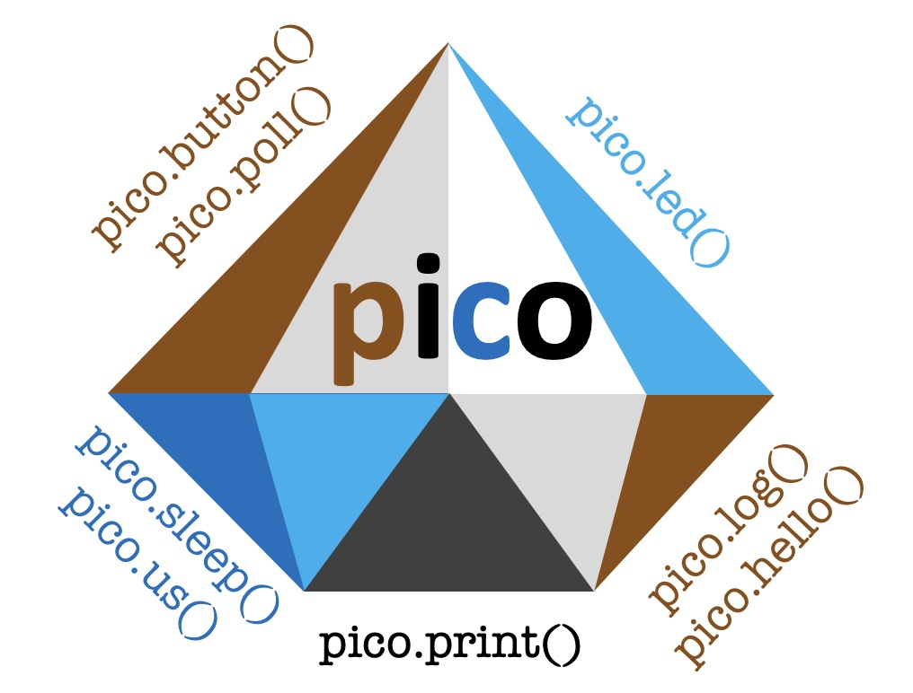

# Pico

The Pico API provides "eight treasures" as basic interactions with an embedded hardware. The API is solely based on a suite of headerfiles.


# What is Pico?

## Overview

Pico is a tiny application interface (API) for embedded systems, which decouples an application software from the underlying real time operating system (RTOS) by a very thin abstraction layer.  In this sense Pico can be easily adopted to various RTOS types or hardware abstractions (like FreeRTOSTM or STM32CubeMX). In this paper, however, we describe Pico in a pure Zephyr RTOS context.

The Pico-API provides a tiny function set, which allows novices to get simple software samples running on embedded hardware. The API provides the following basics: initializing a console and waiting for console readiness, formatted/colored printing to a console, reading a system clock in microseconds, sleeping for a given number of microseconds, level controlled logging with microsecond timestamps, on/off or toggle control of up to four LEDs per board, initializing and setting up a callback for up to four buttons per board.

This contribution is a tutorial for getting quickly running with Zephyr on embedded hardware with tiny sample applications on base of the Pico-API, which can be downloaded free of charge from the internet. A key target of this tutorial is to demonstrate hardware/board independent code prepared for Nordic development kits (DKs) and on a Nordic dongle, and to visualize the log output on various terminal programs.

Once the reader is familiar with building and running of Pico based Zephyr samples, the reader can tackle the next step of how to use Zephyr’s Kconfig system and devicetree for adapting Pico samples to other embedded hardware.


## Introduction

The Zephyr realtime operating system (RTOS) is a power-ful environment to configure and build scalable RTOS kernels for constrained hardware (hardware with limited resource, like RAM and flash memory). Utilizing the kernel configu¬ration (Kconfig) and devicetree system, it is pos¬sible to write hardware/board-independent software for various kinds of embedded hardware.
While these powerful capabilities of Zephyr are impressive, the learning phase of a novice to get familiar with Zephyr can be very tedious, sometimes even be a nightmare.       

Initializing button input and catching a button event with a callback requires usage of seven Zephyr API macros/func¬tions and confronts the user with Kconfig and devicetree magic.
For sure: there is no way around Kconfig and devicetree, when dealing with Zephyr, like with serious mathematics there is no way around differential/integral calculus. But everywhere in the world children will first learn a solid basis of the four basic arithmetic operations (+, -, *, /), before they are facing to the magic of calculus.  

The Pico-API functions in the context of Zephyr compare with the metaphor of basic arithmetic operations  in the context of mathematics. The usage and meaning of the Pico-API functions can be intuitively understood, without knowledge of Zephyr hardcore stuff.


## A Spec for Pico

What are the first things we would like to get running on an embedded hardware?

* Console: we want to print log output and see the text on a terminal program connected to a console
*	Time: we want to know how system time can be read on microsecond granularity, and how we can sleep in low power mode for given microseconds
*	Log: we want to have a log-level controlled log function for formatted/colored output to our console
*	LED: we want to initialize and control a digital output connected to an LED
*	Button: we want to initialize a digital input connected with a pushbutton and setup an according pushbutton callback

Together these five topics form the core-specification of the Pico-API. Having these features available we have a powerful starter kit for debugging and to build quick and dirty user interfaces to visualize states with LEDs and to trigger manually invoked events with buttons.

Additional requirements for the design of the Pico-API are:

*	_Easy-to-Use_: Sole inclusion of the Pico-API header file (#include ”pico.API”) without need of linking an implementation (C-) file should make the functions available.

*	_Smart Naming_: Object oriented languages like C++ offer smart naming of API functions by representing an API by a class instance and API functions by class members. E.g., we have syntax pico.led(…) for a call of member function led() of the pico API. The same can be achieved in C when the API is represented by a data structure with function pointers .

*	_Modular Organization_: To enhance readability and portability the API should have modular organization. According to the Pico core-spec it should be organized as five self-contained basic header files: pico/console.h, pico/time.h, pico/log.h, pico/led.h and pico/button.h. None of the basic header files should have more than 50 lines!


## A Playground for Pico

One of the cheapest ways to get running with Zephyr/Pico is by means of a Nordic nRF52840 dongle, which can be bought for about 10 Euros (figure 1). It comes with one mono-color LED, one RGB LED (in total 4. LED channels) and one push-button.

<p align="center">
   
</p>
<p align="center">
   Figure 1: nRF52840 dongle from Nordic
</p>

A good alternative is a Nordic nRF52832 (about 35€) or nRF52840 (about 45€) develop¬ment kit (DK), and for a combi pack with a dongle no shipping costs are charged. The DKs come with four LEDs and four push-buttons (figure 2).

<p align="center">
   
</p>
<p align="center">
   Figure 2: Nordic nRF52832 DK (left) and nRF52840 DK (right)
</p>

To enable logging from a Zephyr application running on a Nordic dongle requires some special knowledge and preparation.  With Pico we give you a free-riding ticket, which allows you to write code with logging, no matter if you run this code on a DK or on a dongle.
All of these boards support Bluetooth and can be sourced at Mouser, Digikey, Farnell and others.


## Pico API Member Functions

<p align="center">
   
</p>
<p align="center">
   Figure 3: Eight treasures - the main Pico-API member functions
</p>

The API data structure is defined in `pico/api.h` as a structure of function
pointers. The eight main member functions of the Pico-API have the following function prototypes:

```
  typedef struct PI_api {
    void (*print)(PI_txt fmt,...);
    void (*sleep)(PI_ms ms);
    PI_us (*us)(void);
    int (*log)(int lvl,PI_txt fmt,...);
    void (*hello)(int lvl,PI_txt txt);
    int (*led)(int i,int val);
    void (*button)(void(*cb)(int i,int on));
    int (*poll)(int i);
      // ...
  } PI_api;  // pico API

```

It shall be noted that the Pico-API supports further four auxillary functions,
which are for internal use and of of minor importance at the application level.

```
  typedef struct PI_api {
      // ...
    PI_us (*clock)(PI_us us);
    void (*now)(int *min,int *s,int *ms,int *us);
    int (*console)(bool wait);
    void (*vprint)(PI_txt fmt, va_list ap);
    int (*vlog)(int lvl,PI_txt fmt, va_list ap);
  } PI_api;  // pico API
```

# Releases

```
   v0.1.2   17-Feb-2023 Improved Release  
            (built with Zephyr 3.6.0 or NCS 2.5.2)
   v0.1.3   19-Feb-2023 lower case types and rename pico.us() to  pico.usec()
            (built with Zephyr 3.6.0 or NCS 2.5.2)
```
